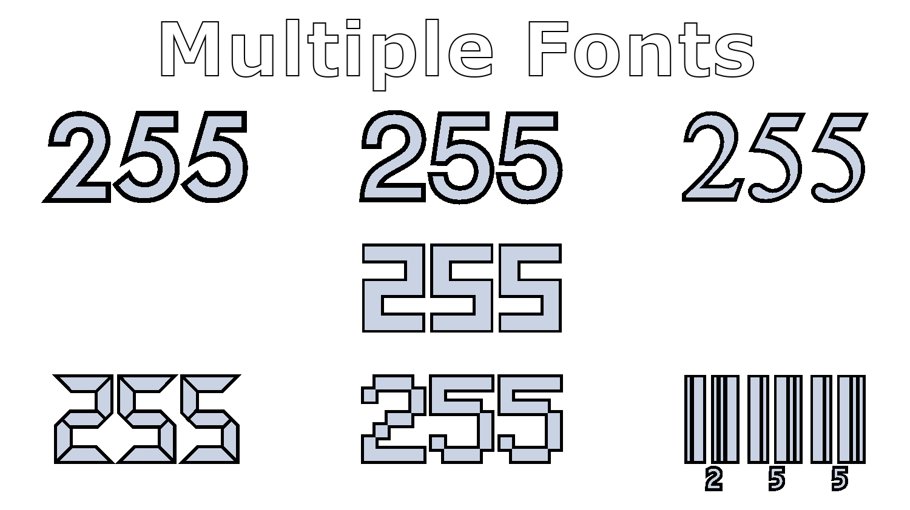
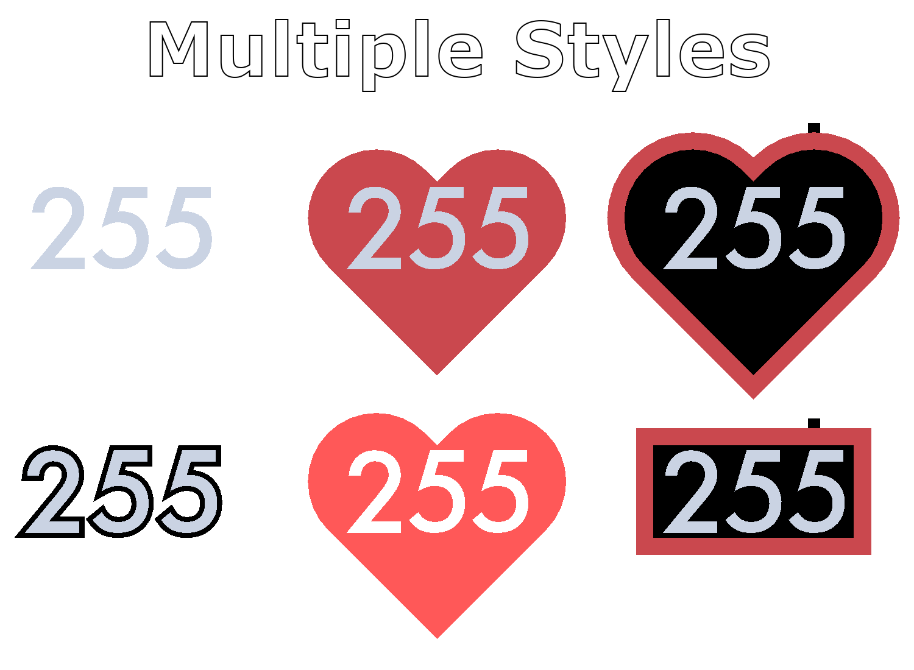

# VRChat Heartrate Monitor Prefab (Quest Compatible)

All that I ask is two things:
- Please do sell this prefab or raise the price of an avatar you are selling because you adding this prefab to. If you place this on a avatar you are selling, please provide credit in the form of a link to the gumroad listing or github repository. 
- If you make any substantial changes that would benefit other players, please fork the repository and publish said changes. Preferably also make a pull request.

## Support

- You can get support in my discord server, the invite is on my [link tree](https://32294.xyz)

## Preview

## Setup
This project was meant to be used with [this](https://github.com/RichardVirgosky/VRChat-Heart-Rate-Monitor) OSC app, I do not plan to support any other OSC apps, but may if you propose a good enough reason for me to.

- Install the previously mentioned OSC app above, **make sure to leave the OSC parameter as the default in its settings (`heartRate`). Do not add it to you're avatar's parameters. VRCFury will merge it in on upload.**
- Install VRCFury using the VRC Creator Companion or Unity Package
- Install the newest version of [Poiyomi shaders](https://github.com/poiyomi/PoiyomiToonShader/releases)
- Make sure your avatar has at least 8 synced bits free in its parameters
- Install the unity package for this project (found in the releases page) or by clicking [here](https://github.com/32294/VRChat_Heart_Rate_Monitor_Prefab_Quest_Compatible/releases/download/7.5.26/heartrate_monitor_7_5_26.unitypackage) 
- Place the configurator prefab (`Assets\32294\heartrate_monitor\(ADD ME) Configure Monitor.prefab`) on your avatar
- Select the relevant options you want in the `Heart Rate Monitor Settings` script and click `Configure` to get a prefab with those options
- If you wish to have sound, use the `Heart Rate Sound Object` script as well and place the prefab it provides where you want the source of the sound to be.
- Upload the avatar, VRCFury will merge all animations and parameters.
- **Make sure you have OSC enabled in the ingame Radial Menu**

# Thanks <3

[Richard Virgosky](https://github.com/RichardVirgosky) - Creating the OSC App

[ManicQuinn](https://github.com/ManicQuinn) - Providing Sound Integration